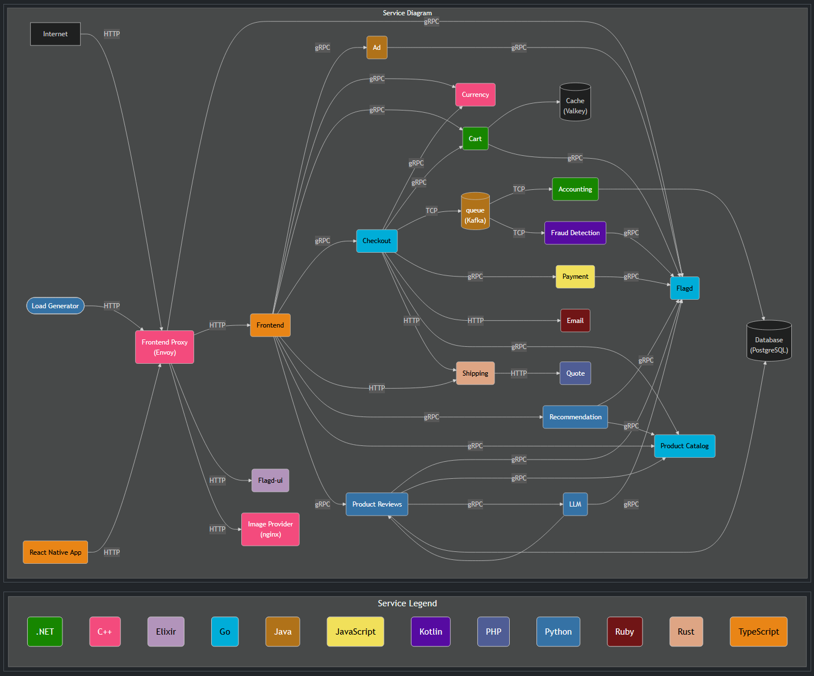

# Eftsure Observability CTF Brief

## Welcome

This is a hands-on **capture-the-flag** to get you comfortable with **Grafana Cloud**. We've injected
real-looking failures into a live "Astronomy Shop" microservices demo. When an issue is triggered, a hidden **flag** (a secret string) shows up somewhere in the telemetry that issue produces.
Your job: find it in Grafana and send it in. Learn the platform, and have some fun doing it.

This will be a **competition** played in **teams of 2–3**, see the **FAQ** for details.

## The system

**Grafana Cloud:** **https://hackathon.grafana.net** . It's the Grafana Cloud
instance holding all of the demo's telemetry logs, metrics and traces and all the other supporting features. Every
flag is found somewhere in here.

The telemetry comes from a microservices demo, an online astronomy store. You can
browse the running app itself at **http://grafana-hackathon.in.eftsure.com**.

> ⚠️ **Note:** *Kafka (queue), Accounting, and Fraud Detection* appear in the standard demo diagram
> but are **not running** for this event — they emit no telemetry, so don't go looking there.

A full list of services with short descriptions — and which ones could surface an issue — is in the
**Appendix**.

## Rules & spirit

- There are probably ways to game this, please don't. The point is to learn Grafana and have fun, so
  stay in the spirit of the event.
- **Alerts aren't your oracle:** no alarms or thresholds have been tuned for this event. Some alerts
  may fire when an issue is triggered and some won't — and a pre-existing warning doesn't mean it's
  the issue you're looking for.
- **Grafana Assistant (AI) and gcx CLI access are disabled** on purpose — so you get hands-on with the
  platform itself.
- **Shared instance:** everyone is on the same Grafana. Anything you create (dashboards, etc.) is
  visible to everyone else, so be considerate and respectful of what you and others are creating.

## FAQ

**What does a flag look like, and where do they hide?**

Flags look like `EFTSURE_FLAG{...}` — for example `EFTSURE_FLAG{example_3f9k2}`. Each one is a
deliberate string planted in the broken service's telemetry. Some examples of places a flag could
hide:

- **Logs** — in a log line or a log field.
- **Metrics** — as a label value on a metric.
- **Traces** — as an attribute on a span.

Some only appear once a problem is **severe** (a threshold crossed) or **intermittently** (only on
some requests), so keep looking even if the first place you check is empty.

**What do I do once I find a flag?**

DM **Scotty** with three things:

- the **flag value** (`EFTSURE_FLAG{...}`)
- a **screenshot** of where you found it
- your **team name**

Found it early? Use the time to get more familiar with the platform and set yourself up for a future
flag, or keep an eye out for other flags that might already be in action.

**How does scoring work?**

When an issue is triggered, a **30-minute clock** starts for that flag. Your score is the number of
**minutes remaining** when you submit it correctly — find it 1 minute in and you score ~29; find it
29 minutes in and you score 1; miss it within 30 minutes and it's 0. The cadence is loose: a new issue
may start before the previous one is found, and a couple may run at once — each flag has its own clock
from the moment it was triggered.

**How do teams and prizes work?**

You'll play in **teams of 2–3**. Points add up across all the flags you find through the day, and the
**team with the most points at the end of the day wins**.

**Which services can (and can't) have issues?**

Issues never come from the support/infrastructure services — `frontend-proxy`, `otel-collector`,
`telemetry-docs`, `flagd`, `flagd-ui`, `load-generator` — nor from Kafka, Accounting or Fraud
Detection (not running this event). Any other application service is fair game; see the Appendix for
the full list and which ones could surface an issue.

**Where do I go?**
- Grafana (hunt for flags here): **https://hackathon.grafana.net**
- The demo app (browse the store): **http://grafana-hackathon.in.eftsure.com**
- Scoreboard (live standings): **https://scoreleader.com/u/33BHFQO**

**What if I get stuck?**
Keep an eye on the **meeting chat** — we'll post periodic messages there as each issue is released
(though not immediately, so it pays to stay proactive).

If you have any
questions or concerns at any point, reach out in the main room or to a facilitator and we'll get
someone to support you.

## Appendix — Services in the demo

"Could surface an issue?" tells you the *universe* of possible sources — not which are actually live
right now (that's the hunt).

| Service | What it does | Could surface an issue? |
|---------|--------------|:-----------------------:|
| **frontend** | Web storefront UI and its API (Next.js / TypeScript) | Yes |
| **ad** | Serves contextual ads on product pages (Java) | Yes |
| **cart** | Holds each user's shopping cart, backed by the Valkey cache (.NET) | Yes |
| **checkout** | Orchestrates placing an order; calls payment, shipping, email, cart (Go) | Yes |
| **currency** | Converts prices between currencies (C++) | Yes |
| **payment** | Charges the credit card for an order (Node.js) | Yes |
| **shipping** | Calculates shipping cost and tracking; calls quote (Rust) | Yes |
| **quote** | Computes a shipping-cost quote (PHP) | Yes |
| **email** | Sends the order-confirmation email (Ruby) | Yes |
| **product-catalog** | Product listings, details and search, backed by PostgreSQL (Go) | Yes |
| **recommendation** | Suggests products based on the cart (Python) | Yes |
| **product-reviews** | Generates and serves product reviews (uses the LLM service) | Yes |
| **llm** | Local language-model service used for review summaries | Yes |
| **image-provider** | Serves product images (nginx) | Yes |
| **frontend-proxy** | Envoy edge proxy; the entry point routing all traffic | No |
| **flagd** | The feature-flag service used to trigger the issues | No |
| **flagd-ui** | Web UI for toggling feature flags | No |
| **load-generator** | Drives synthetic shopper traffic so there's always activity | No |
| **otel-collector** | Receives, processes and ships all telemetry to Grafana Cloud | No |
| **telemetry-docs** | Auto-generated documentation of the demo's telemetry | No |
| **cache (Valkey)** | Redis-compatible cache backing the cart | No |
| **database (PostgreSQL)** | Product-catalog data store | No |
